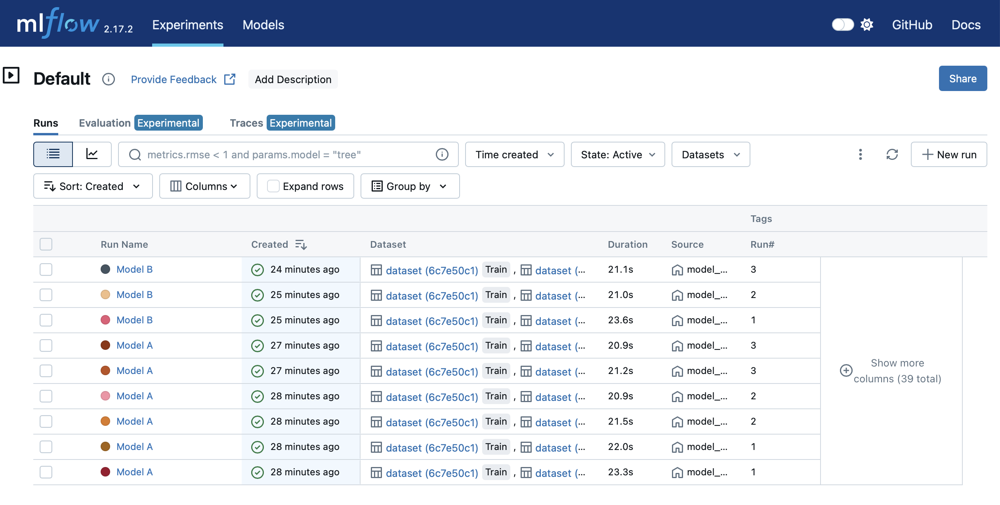

# MLFlow Tracker Implementation

## Archive Series (Arcs)
Archive Series, where I record my codes for reference purposes

## Info
This is the implementation of MLFlow tracker on a normal tensorflow model. It demonstrates how to run multiple instances of the same experiment on a GPU and record them in MLFlow. It also shows that a separate model can be run and recorded on another GPU concurrently.

## Mlflow GUI
<p align="center"></p>

## Requirements
Install using pip
- tensorflow==2.13.0
- mlflow==2.17.2

## Set-up Mlflow Server
Create a folder named ```mlflow_model_runs``` in root then run this line
    
    mlflow ui --backend-store-uri sqlite:///./mlflow_model_runs/model_runs.db --default-artifact-root ./mlflow_model_runs/model_artifacts 

```backend-store-uri``` creates the database for the experiment runs

```default-artifact-root``` creates a folder where the weights and metrics are saved

After running the mlflow server, normally, it can be access through the browser and usually at this address ```http://127.0.0.1:5000```.

## Run the main code
The model here is a dummy model from the tensorflow documentation, which can be swapped by the appropriate one. Models A and B are just distinctions between two different models.

To run the model experiments, use the main-controllers. There are 2 main-controllers, which corresponds to each gpu available. In this example, the ```main-controller.py``` runs the model_A multiple times (i.e., 3x) while recording the results in mlflow.

    *for running model A*
    python main-controller.py

    *for running model B*
    python main-controller-2.py
    
## Notes
The purpose of the work is for tracking numerous experiments while testing the robustness of a particular model by running it multiple times.